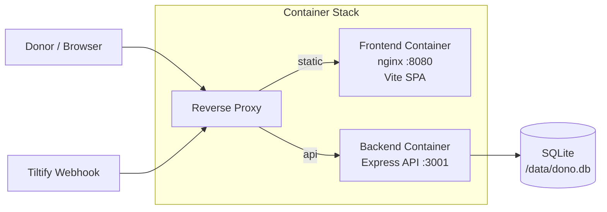
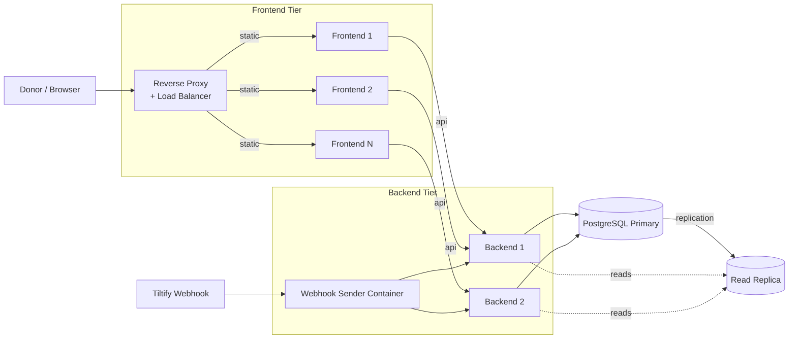

# Production Deployment

The project uses a **two-container** architecture: a Node.js Express API (`Dockerfile.backend`) and an nginx SPA server (`Dockerfile.frontend`).



## Container Architecture

- **Backend** (`Dockerfile.backend`): Multi-stage build (`base` → `deps` → `runtime`). Runs as non-root user `dono` (UID 1001). Applies Prisma migrations on startup via `docker-entrypoint.backend.sh`. Exposes port 3001. SQLite database lives on volume mount `/data`.
- **Frontend** (`Dockerfile.frontend`): Multi-stage build (`builder` → `runner`). Builds the Vite SPA, serves via `nginx-unprivileged` on port 8080, proxies `/api/` to the backend. Runs as non-root `nginx` user.

Both images include `HEALTHCHECK` instructions. The backend checks `GET /api/health`, the frontend checks `GET /`.

## Building and Running with Docker Compose

```bash
# Build and start the full stack
ADMIN_API_KEY=change-me docker compose up --build

# Frontend available at http://localhost:8080 (proxies /api to backend)
# SQLite data persisted in the dono-data volume
```

For production, set all environment variables via a `.env` file or shell environment:

```bash
# Create a production .env file
cat > .env.production << 'EOF'
TILTIFY_CLIENT_ID=your_client_id
TILTIFY_CLIENT_SECRET=your_client_secret
TILTIFY_CAMPAIGN_ID=your_campaign_id
TILTIFY_DONATE_URL=https://donate.tiltify.com/your-campaign
TILTIFY_DONATE_ID=your-donate-id
TILTIFY_WEBHOOK_RELAY_ID=your_relay_id
TILTIFY_WEBHOOK_SECRET=your_webhook_secret
ADMIN_API_KEY=your-secure-admin-key
MODERATOR_API_KEY=your-secure-moderator-key
METRICS_API_KEY=your-secure-metrics-key
ADMIN_EMAILS=owner@example.com
MODERATOR_EMAILS=mod1@example.com,mod2@example.com
SMTP_HOST=smtp.example.com
SMTP_PORT=587
SMTP_SECURE=false
SMTP_USER=your_smtp_user
SMTP_PASS=your_smtp_password
EMAIL_FROM="Donation Platform <donations@example.com>"
APP_BASE_URL=https://donations.example.com
RATE_LIMIT_SPEND=20
EOF

# Start with the env file
docker compose --env-file .env.production up -d
```

## Manual Container Build

```bash
# Backend
docker build -f Dockerfile.backend --target runtime -t esa-dono-ui/backend:latest .

# Frontend
docker build -f Dockerfile.frontend -t esa-dono-ui/frontend:latest .
```

## Smoke Test

Verify the stack is functional:

```bash
ADMIN_API_KEY=change-me FRONTEND_PORT=18080 ./scripts/smoke-test.sh
```

The smoke test validates: backend health through nginx proxy, SPA index serving, client-side route fallback, admin auth enforcement, end-to-end donation simulation (proves migrations + DB writes), and volume persistence across a backend restart.

## Reverse Proxy Configuration

For deployments using an external reverse proxy (nginx, Caddy, etc.) instead of the frontend container:

**nginx:**

```nginx
server {
    listen 443 ssl;
    server_name donations.example.com;

    # Backend API (Dockerfile.backend exposes port 3001)
    location /api/ {
        proxy_pass http://127.0.0.1:3001;
        proxy_http_version 1.1;
        proxy_set_header Host $host;
        proxy_set_header X-Real-IP $remote_addr;
        proxy_set_header X-Forwarded-For $proxy_add_x_forwarded_for;
        proxy_set_header X-Forwarded-Proto $scheme;
        client_max_body_size 2m;
    }

    # Frontend SPA (served from dist/ or a frontend container on :8080)
    location / {
        proxy_pass http://127.0.0.1:8080;
        proxy_http_version 1.1;
        proxy_set_header Host $host;
    }
}
```

**Caddy:**

```
donations.example.com {
    reverse_proxy /api/* 127.0.0.1:3001
    reverse_proxy /* 127.0.0.1:8080
}
```

## Key Deployment Notes

- **Volume mount**: In production, mount a persistent volume at `/data` in the backend container. The `docker-compose.yml` does this via the `dono-data` named volume.
- **No secrets baked in**: Config is injected via environment variables at runtime. No defaults for secrets exist in the images.
- **Non-root**: Both containers run as non-root users.
- **Migrations**: The backend entrypoint runs `prisma migrate deploy` on every startup, making it safe to update images without manual DB intervention.

## Future / Production at Scale

For high-traffic campaigns the stack scales horizontally: multiple load-balanced frontend containers, a horizontally scalable backend tier, PostgreSQL (replacing the single-file SQLite) with a read replica, and a dedicated webhook sender container that decouples webhook ingestion from API serving so Tiltify events survive backend restarts/rollouts.


